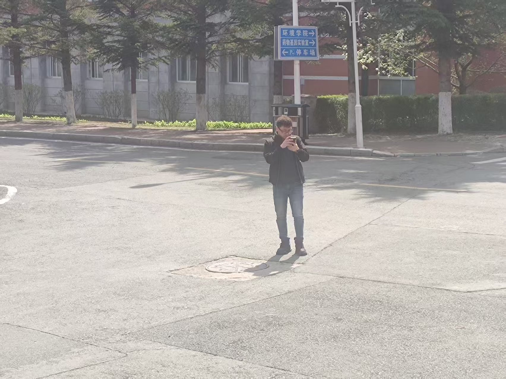
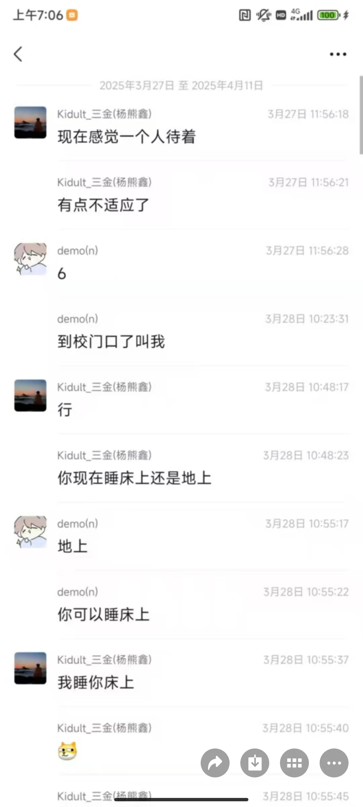
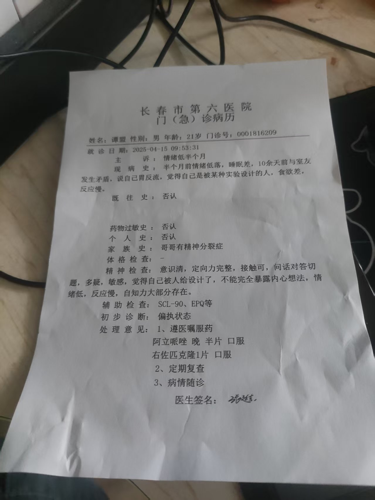
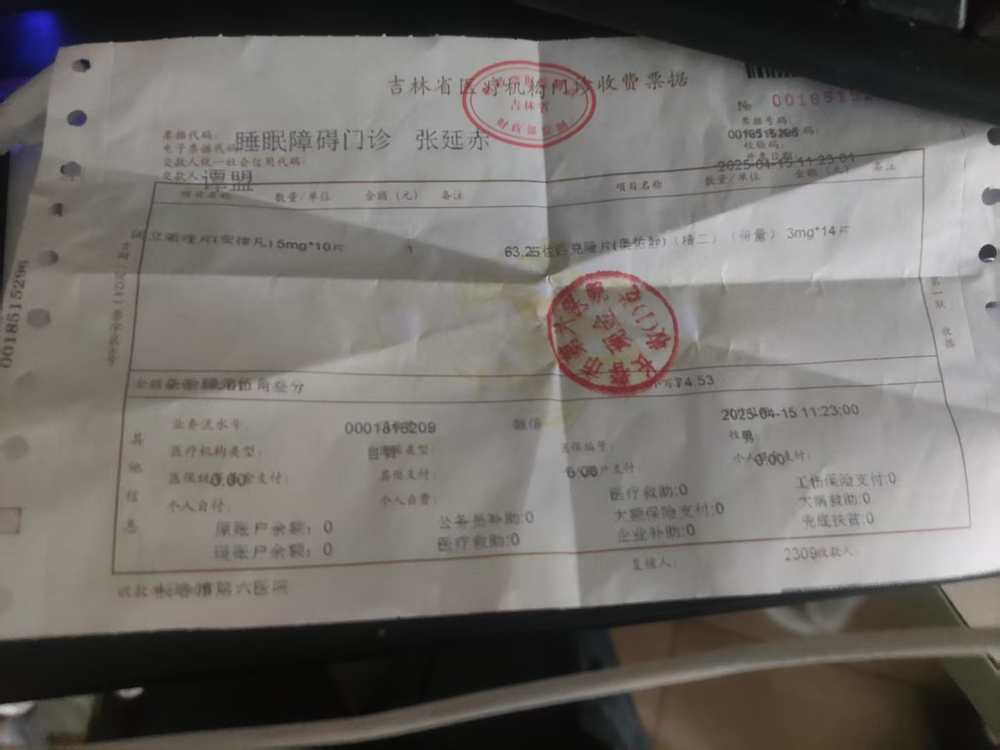
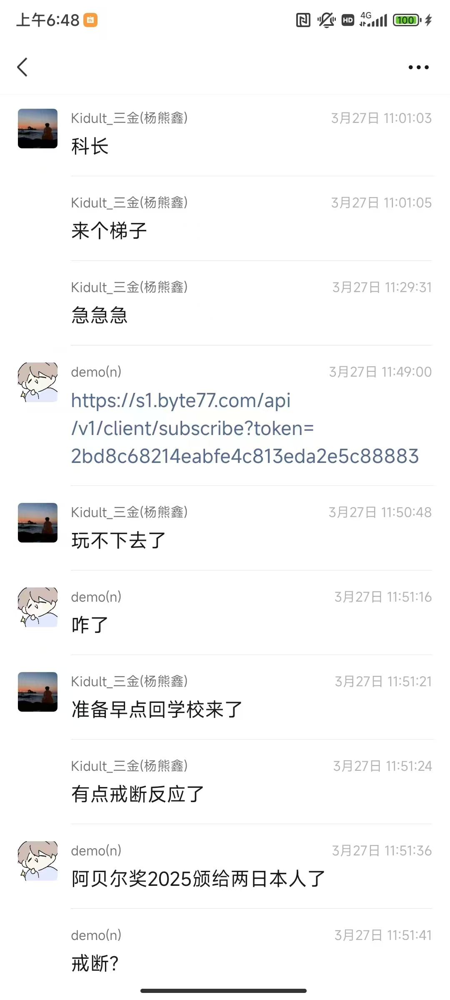

# NENU-CS-April

东北师范大学信息科学与技术学院对抗组织调查证据

这位老师是殷老师的朋友？

这是武新皓？

这位老师不太认识

# 首先是指控

## 指控1，东北师范大学信息科学与技术学院恶意诬告他人有精神疾病，导致谭同学去长春市第六医院就诊

## 指控2，东北师范大学信息科学与技术学院指使教唆压迫同学，掩盖，销毁证据，串供，对抗组织调查

参考录音文件
https://huggingface.co/datasets/tannal/NENU-CS-April

梁琦玟和谭盟对话，时间是2025年5月5日八点后

## 指控3，东北师范大学信息科学与技术学院包庇涉案人员，指使涉案人员潜逃

杨熊鑫等人，证据确凿

## 指控4，东北师范大学信息科学与技术学院2020级本科生，2024级研究生李然 王承越等人受指使向涉案人员杨熊鑫等人通风报信，对抗组织调查

东北师范大学政法学院可能牵扯其中
东北师范大学经济管理学院可能牵扯其中
东北师范大学数学与统计学院可能牵扯其中

腾继波、李然、武新皓、杨熊鑫是重要人物

于越及其朋友对案件内容均毫不知情，但无奈牵扯其中，杨熊鑫，李然，武新皓，王承越与她们牵扯其中有关，谭盟看起来有关但毫不知情

夏华A栋3楼也有一部分参与对抗组织调查

若东北师范大学信息科学与技术学院仍然对抗组织调查，将会面临更多铁证。

